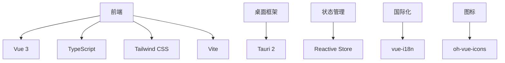

# Alfred - 智能文件管理器

Alfred 是一款现代化的桌面文件管理应用，基于 Tauri + Vue 3 + TypeScript 构建，专注于提供优雅的文件组织和管理体验。

## 功能特性

### 📁 资源库管理
- **多库支持**：创建多个独立资源库分类管理文件
- **智能添加**：拖拽文件/文件夹或通过按钮选择添加
- **动态视图**：卡片视图与列表视图自由切换
- **视觉缩放**：滑块调节卡片大小

### 🔖 标签系统
- **标签过滤**：按标签筛选查看文件
- **批量编辑**：为多个文件统一添加/删除标签
- **标签管理**：重命名或删除标签
- **未标记文件**：快速查找未打标签的文件

### 🎯 高级功能
- **全局搜索**：实时搜索文件名和扩展名
- **多维排序**：按名称、日期、大小、类型排序
- **文件预览**：支持图片、视频等格式的快速预览
- **批量操作**：支持多选文件进行统一处理

### 🌐 国际化
- 双语支持：简体中文、English
- 自动检测：根据系统语言自动切换
- 手动设置：可在设置中修改语言偏好

### ⚙️ 系统集成
- **任务栏托盘**：后台运行，点击图标快速打开
- **开机启动**：可配置登录时自动启动
- **系统样式**：跟随系统深色/浅色模式
- **快捷键**：支持常用操作的键盘快捷方式

## 技术架构



## 快捷键

| 快捷键 | 功能 |
|--------|------|
| Ctrl+A | 全选文件 |
| Delete | 删除选中文件 |
| Space | 预览选中文件 |
| Ctrl+Shift+F | 显示筛选面板 |
| Esc | 关闭当前弹窗 |

## 安装使用

### 开发环境
```bash
# 克隆项目
git clone https://github.com/nayamior/alfred.git

# 进入目录
cd alfred

# 安装依赖
pnpm install

# 启动开发服务器
pnpm dev

# 构建生产版本
pnpm build
```

### 生产环境
下载最新发行版安装包，双击安装即可使用。

## 目录结构

```
├── src/
│   ├── components/     # Vue组件
│   ├── views/           # 页面视图
│   ├── stores/         # 状态管理
│   ├── i18n/           # 国际化
│   └── assets/         # 静态资源
├── src-tauri/          # Tauri原生代码
└── dist/               # 构建输出
```

## 贡献指南
欢迎提交 issue 和 pull request！

请遵守以下规范：
- 提交前确保代码通过 ESLint 检查
- 保持代码风格一致性
- 为新功能添加适当注释
